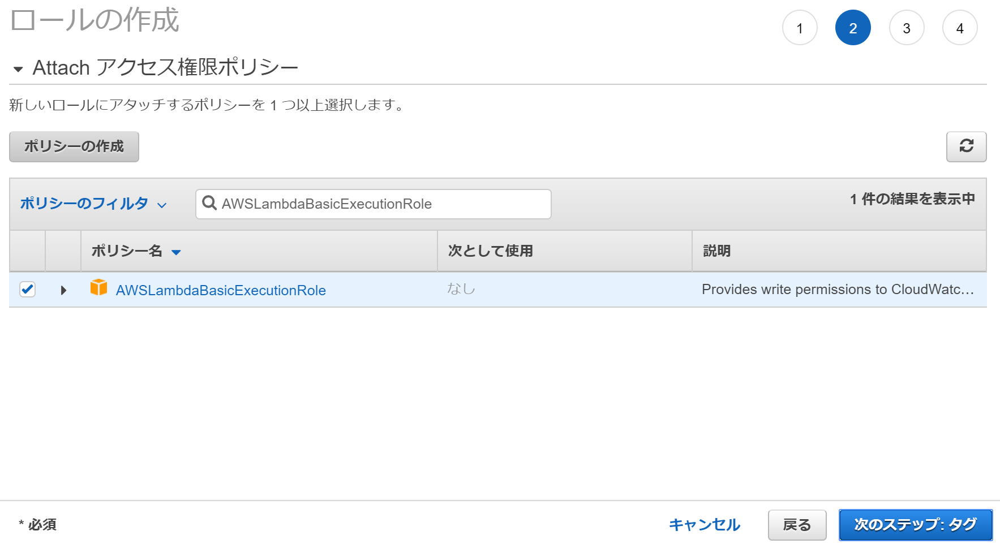
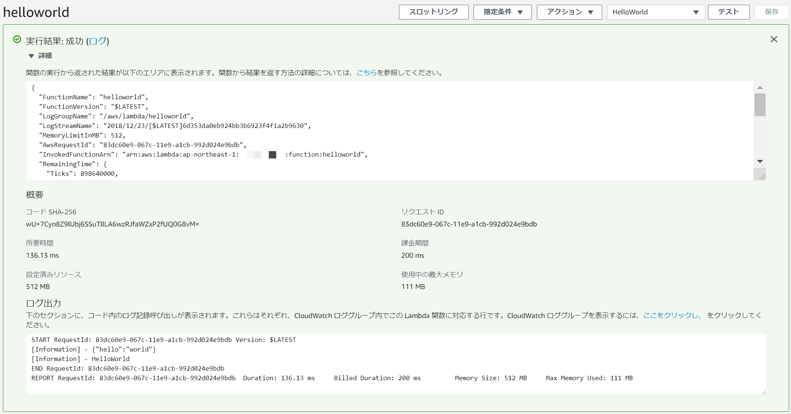

# 🔰AWS Lambda+PowerShell Coreをさわってみる

※本記事は[PowerShell Advent Calendar 2018](https://qiita.com/advent-calendar/2018/powershell)の24日目になります。

2018年9月にAWS LambdaでPowerShell Coreがサポートされたとリリースが出ました。

[AWS Lambda は PowerShell Core をサポートします](https://aws.amazon.com/jp/about-aws/whats-new/2018/09/aws-lambda-supports-powershell-core/)

今回は環境準備からHelloWorldまでをやってみたいと思います。
一応ですがPowerShell Coreがサポートされたのであって、Windows PowerShellはまったく関係ないのであしからず。

## 🔰環境

- Windows 10
- PSVersion 6.1.1

## 🔰ドキュメント

AWSのブログ、基本的にこの通りにやればうまくいく。

- [Announcing Lambda Support for PowerShell Core](https://aws.amazon.com/jp/blogs/developer/announcing-lambda-support-for-powershell-core/)

AWS Lambdaの開発者ドキュメント。こちらもわかりやすく解説されています。

- [AWS ドキュメント/PowerShellの操作](https://docs.aws.amazon.com/ja_jp/lambda/latest/dg/powershell-programming-model.html)

## 🔰モジュールとかSDKとか　環境準備

LambdaでPowerShell Coreを利用するために下記のモジュールとSDKのインストールを行います。
そもそもPowerShell Coreをインストールしていない場合はPowerShell Coreのインストールから行ってください。

- [PowerShell/PowerShell](https://github.com/PowerShell/PowerShell/blob/master/README.md)
- [AWSPowerShell.NetCore](https://www.powershellgallery.com/packages/AWSPowerShell.NetCore/3.3.428.0)
- [AWSLambdaPSCore](https://www.powershellgallery.com/packages/AWSLambdaPSCore/1.1.0.0)
- [.Net Core SDK](https://dotnet.microsoft.com/download)

必要となるモジュールについてはPowerShell Galleryで公開されているため下記コマンドでインストールできます。
※公式ブログ記事とかだとインストールのスコープがCurrentUserになってますが、そこらへんはお好みで。

```PowerShell
Install-Module -Name AWSLambdaPSCore
Install-Module -Name AWSPowerShell.NetCore
```

AWSLambdaPSCoreモジュールでは下記のようなコマンドが用意されているようです。


コマンドについては[AWSLambdaPSCore モジュールを使用する](https://docs.aws.amazon.com/ja_jp/lambda/latest/dg/lambda-powershell-how-to-create-deployment-package.html#lambda-powershell-using-lam-mod-deployment-package)に説明があります。

余談ですが`Publish‑AWSPowerShellLambda`コマンドでLambdaにpublishする際に、内部的には[aws/aws-extensions-for-dotnet-cli](https://github.com/aws/aws-extensions-for-dotnet-cli#aws-lambda-amazonlambdatools)を利用しており。
コマンド実行時に`dotnet tool install -g Amazon.Lambda.Tools`コマンドで .NET Core グローバル ツール(Amazon.Lambda.Tools)のインストールやらpublishが行われているようです。
AWSLambdaPSCoreモジュールを動かすのに.NET Core SDKが必要な理由はこれがあるかららしい。

## 🔰HelloWorldをやってみる

### 🔰利用可能なテンプレートを確認する

まずは`Import-Module AWSLambdaPSCore`でモジュールをインポート。
`Get-AWSPowershellLambdaTemplate`コマンドで用意されているテンプレートにどんな物があるか確認してみます。


いろいろと用意されているようですが、HelloWorldなのでBasicなテンプレートを利用してみます。

### 🔰テンプレートからサンプルスクリプトを生成してみる

`New-AWSPowerShellLambda`コマンドでBasicテンプレートのファイルを生成します。


ファイルが生成されています。


生成されたps1ファイルの中身をみると下記のようになっています。
このサンプルファイルの中身を読んで、どうなっているのか確認していきます。


#### 🔰特殊な変数

サンプルスクリプトやドキュメントを読んでみると特殊な変数が用意されている事がわかります。

Variable         | Description
---------------- | ---------------------------
`$LambdaInput`   | Lambdaへの入力データが格納されるオブジェクト。
`$LambdaContext` | 実行しているLambda環境についての情報が格納される。(Amazon.Lambda.Core.ILambdaContext)

`$LambdaContext`の詳細については下記が詳しい。

[PowerShell の AWS Lambda Context オブジェクト](https://docs.aws.amazon.com/ja_jp/lambda/latest/dg/powershell-context-object.html)

#### 🔰戻り値

戻り値については下記のように書かれています。

> The last item in the PowerShell pipeline will be returned as the result of the Lambda function.

どうやら出力ストリームの最後のアイテムを戻り値として返してそうです。

[AWSLambdaPSCore モジュールを使用する](https://docs.aws.amazon.com/ja_jp/lambda/latest/dg/lambda-powershell-how-to-create-deployment-package.html#lambda-powershell-using-lam-mod-deployment-package)に下記のようなサンプルがあり、これで$PSVersionTableを戻り値として返せるらしい。

個人的には変数だけでなく`Write-Oputput`を書くほうが好みです……

```PowerShell
Write-Host (ConvertTo-Json -InputObject $LambdaInput -Compress -Depth 5)
$PSVersionTable
```

#### 🔰#Requiresステートメント

`#Requires`ステートメントを利用すると任意のモジュールがLambdaで利用できるようになるようです。
指定したモジュールをpublishするファイルに含めてくれたり色々とうまいことやってくれる様子。
サンプルでは下記のようにAWSPowerShell.NetCoreを読み込んでいる。

`#Requires -Modules @{ModuleName='AWSPowerShell.NetCore';ModuleVersion='3.3.390.0'}`

#### 🔰CloudWatch Logsへ書き込み

サンプルにはコメント外せば入力データがCloudWatch Logsに書き込みされるようなサンプルコードが記載されています。
`Write-Host`でCloudWatch Logsに書き込みができそうです。

`Write-Host (ConvertTo-Json -InputObject $LambdaInput -Compress -Depth 5)`

### 🔰サンプルスクリプトを編集してみる

とりえあず今回は下記のように生成したサンプルスクリプト(pwshLambdaHelloWorld.ps1)を書き換えてみました。

- 説明コメント部分を削除したり。
- AWSPowerShell.NetCoreは使わないので`#Requires`ステートメントは削除したり。
- Write-HostでCloudWatch Logsへ入力データをjson形式に変換して出力してみたり。
- 戻り値に$LambdaContextをjson形式に変換して渡してみたり。

だいぶ単純な形におちつきました。

```PowerShell
# 入力データをJson形式に変換してWrite-HostでCloudWatch Logsへ書き出す
Write-Host (ConvertTo-Json -InputObject $LambdaInput -Compress -Depth 5)

# HelloWorld
Write-Host "HelloWorld"

# 戻り値として$LambdaContextをjson形式に変換して出力ストリームに書き込み
Write-Output (ConvertTo-Json -InputObject $LambdaContext -Compress -Depth 5)
```

## 🔰IAMロールの準備をする

Lambda関数に割り当てるIAMロールを準備します。

今回のHelloWolrd用に良さそうな標準ポリシー(AWSLambdaBasicExecutionRole)が用意されているので今回はこれを利用してIAMロールを作成します。
Lambdaのアクセス権限については下記ページを参照の事。

[AWS Lambda アクセス権限モデル](https://docs.aws.amazon.com/ja_jp/lambda/latest/dg/intro-permission-model.html#lambda-intro-execution-role)

IAMのロールの作成でAWSサービスはLambdaを選択して次へ


AWSLambdaBasicExecutionRoleを選択して次へ



次へ


ロール名 lambda_pwsh_helloworld を入力して次へ


IAMロールが作成できました。
Publish時に利用するのでロールARNは控えておいて下さい。


## 🔰Publish-AWSPowerShellLambdaでPublish

`Publish-AWSPowerShellLambda`コマンドでpublish。
下記の例ではProfileNameで接続する資格情報を指定していますが、そこらへんは各自お好きな方法でどうぞ。

```PowerShell
Publish-AWSPowerShellLambda -ProfileName プロファイル名 -Name helloworld -ScriptPath 作成したスクリプトのパス -Region ap-northeast-1 -IAMRoleArn 作成したロールのARN
```


無事、publishできました。


初回のpublishではロールの指定を行う必要があるため`IAMRoleArn`で指定を行いましたが、指定しなくても下記のように実行時にコンソール上で選択できたりもします。


### 🔰余談　Publish時にはまった

自分の端末環境で`Publish-AWSPowerShellLambda`コマンドがエラーとなってPublishができない状態に陥りました。

原因を探ってみると、Publish-AWSPowerShellLambda内で行っている`dotnet tool install -g Amazon.Lambda.Tools`が失敗していて……なぜ？　と思い色々と確認してみると。

過去、Nugetのパッケージソースの設定を自分でぶっこわしていたようで、下記にあるNuget.orgの設定がなくなっていたことが発覚……


`Set-PackageSource`コマンドでNuget.orgのソースを追加した所、無事動き出しpublishできるようになりました。

## 🔰作成したLambdaを実行してみる

とりあえず今回は下記の三通りの実行方法で実行してみる。

- AWSコンソールから
- Invoke-LMFunctionコマンドから(PowerShell.NetCore)
- Amazon.Lambda.Tools(.NET Core グローバル ツール)から

### 🔰Lambdaを実行(コンソールから)

作成した関数helloworldからテストイベントの設定を選択


下記のようなテストイベントを作成

とりえあずjson形式でhello worldな感じ。


作成したテストイベントHelloWorldを指定してテストを実行


戻り値として$LambdaContextをjson形式に変換した物が赤枠に表示されています。

またログ出力にWrite-HostでCloudWatch Logsにテストイベントで設定した入力データをjson形式に変換したものと、helloworldの文字列が出力されている事が確認できました。



### 🔰Lambdaを実行(AWSPowerShell.NetCoreのInvoke-LMFunctionコマンドから)

AWSPowerShell.NetCoreの`Invoke-LMFunction`コマンドを利用してLambdaを実行してみます。

[Invoke-LMFunction](https://docs.aws.amazon.com/powershell/latest/reference/items/Invoke-LMFunction.html)

```PowerShell
$inputData = [pscustomobject]@{"hello"="world"} | ConvertTo-Json
$return=Invoke-LMFunction -ProfileName プロファイル名 -FunctionName helloworld -Payload $inputData -Region ap-northeast-1 -LogType tail
$return
```

StatusCodeが200で正常終了したようです。


戻り値はPayloadプロパティにSystem.IO.MemoryStreamで格納されていて、またLogTypeオプションをtailで実行するとLogResultにはログ最後の4KBをbase64-encodedされた物が格納されるようです。

System.IO.MemoryStreamを文字列に変換したり、base64を変換するのは一手間かかるなと思っていたら、下記のような便利なモジュールを公開している人がいました。

[Announcing 'Convert', a PowerShell Module for common object conversions.](https://andrewpearce.io/powershell/2018/05/31/announcing-convert/)

[Convert](https://www.powershellgallery.com/packages/Convert/0.2.1.1)

このモジュールに含まれる`ConvertTo-String`を使うとお手軽にSystem.IO.MemoryStreamだったりbase64エンコードから文字列を抽出できます。　便利。


### 🔰Lambdaを実行(Amazon.Lambda.Toolsから)

`Amazon.Lambda.Tools`を利用してLambdaを実行してみます。

[aws/aws-extensions-for-dotnet-cli - Invoke Function](https://github.com/aws/aws-extensions-for-dotnet-cli#invoke-function)

```PowerShell
dotnet lambda invoke-function helloworld  --profile プロファイル名 --region ap-northeast-1 --Payload '{\"hello\":\"world\"}'
```


Payloadでエスケープ文字を利用してますが下記を参考しました。Amazon.Lambda.toolsでPayloadにjson形式で渡すにはちょっと小細工が必要な様子。

[Question: send json payload?](https://github.com/aws/aws-lambda-dotnet/issues/82)

## 🔰Publishされるzipファイルについて

今回の数KByteのps1でもPublish‑AWSPowerShellLambdaで生成されるzipファイルは11MByteほどありました。

`#Requires`ステートメントを利用して任意のモジュールを追加していくとサイズは更に増加します。
(AWSPowerShell.NetCoreを含めると23MByteでした)

Lambdaをちょっと修正してアップロードして確認してというのをぐるぐる回すにはなかなかしびれるファイルサイズな気がします。
ココらへんもう少しファイルサイズが軽くなったりしたら素敵な感じなんですが……

下記のような会話もあったりして将来に期待したいですね。

[aws/aws-lambda-dotnet - #issue #319 disappointed with the powershell implementation](https://github.com/aws/aws-lambda-dotnet/issues/319)

## 🔰総評

自分の端末環境ではNugetのパッケージソース設定をぶっこわしておかしい状態だった為、Publishができず意外とハマってしまいましたが。
基本的にはさっくり環境設定できて簡単に実行できる気がします。
